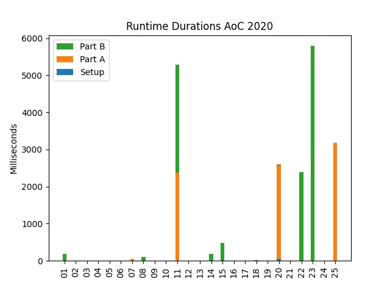

# AdventOfCode2020
[AdventOfCode Coding Challenges 2020 - Calendar](https://adventofcode.com/2020) 

[Puzzle input](inputs) `inputs/dayXX_input.txt` given from calendar as well as the [program-output](outputs) `outputs/dayXX_output.txt` are included with the [code](code) in `code/dayXX.py` itself.
A summarized output of all days can be found in [`Outputs.txt`](Outputs.txt) as well as the average runtime duration per day and in total

# Personal Stats
```
      --------Part 1--------   --------Part 2--------
Day       Time   Rank  Score       Time   Rank  Score
 25
 24
 23
 22   13:03:58  13318      0   18:14:16  11543      0
 21
 20   22:01:22  11809      0       >24h   8506      0
 19
 18   16:47:45  17022      0   17:48:05  15409      0
 17
 16   06:46:24  14548      0   08:19:39  10939      0
 15   09:56:12  18695      0   09:57:05  16650      0
 14   02:38:14   8430      0   05:58:56   9830      0
 13   01:30:18   7934      0   06:51:15   8483      0
 12   03:52:16  11277      0   06:01:19  12451      0
 11   00:51:57   4529      0   01:44:24   5156      0
 10   00:07:45   1244      0   00:42:27   2167      0
  9   05:18:37  22738      0   05:23:11  20552      0
  8   00:56:28   9230      0   01:08:54   7015      0
  7   00:39:34   3488      0   01:04:11   3550      0
  6   22:56:17  51615      0   23:05:07  49865      0
  5   01:05:20   8631      0   01:16:47   8177      0
  4   00:14:09   2574      0   01:43:03   7444      0
  3   00:11:32   2851      0   00:14:00   1822      0
  2   00:08:13   1731      0   00:20:07   3065      0
  1   00:50:03   5485      0   01:46:34   7290      0
```
# Runtime Durations

<!--
After this, insert runtime durations automatically
-->
```bash 
---------------runtime duration (ms)---------------
             SETUP                 A                   B
Day 01:       0.0                 5.0               185.0
Day 02:       1.0                 1.0                 2.0
Day 03:       1.0                 0.0                 0.0
Day 04:       2.0                 0.0                 1.0
Day 05:       1.0                 2.0                 2.0
Day 06:       2.0                 1.0                 2.0
Day 07:       4.0                50.0                 0.0
Day 08:       0.0                 1.0               111.0
Day 09:       1.0                 3.0                 5.0
Day 10:       1.0                 0.0                 0.0
Day 11:       2.0              2235.0              2674.0
Day 12:       0.0                 1.0                 1.0
Day 13:       0.0                 6.0                 0.0
Day 14:       1.0                 3.0               185.0
Day 15:       0.0                 1.0               545.0
Day 16:       1.0                 0.0                 0.0
Day 17:       0.0                 0.0                 0.0
Day 18:       1.0                15.0                14.0
Day 19:       0.0                 0.0                 0.0
Day 20:      58.0              2550.0                19.0
Day 21:       0.0                 0.0                 0.0
Day 22:       0.0                 0.0              2406.0
Day 23:       0.0                 0.0              6651.6
Day 24:       0.0                 0.0                 0.0
Day 25:       0.0              3283.1                 0.0
Total execution time:    21036.9 ms on average (1 iterations)
``` 
